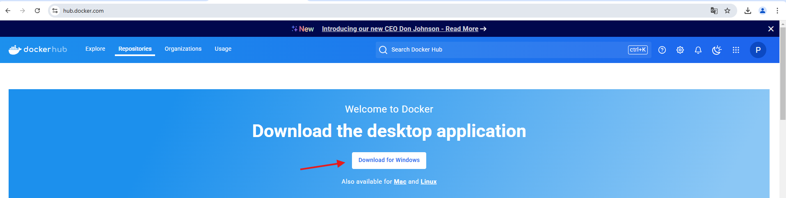

# Ejercicio 1 - Manual de Docker Desktop

# Introducción

Docker Desktop es una aplicación que permite desarrollar, probar y desplegar aplicaciones en contenedores de forma sencilla.

# Instalación

## Requisitos

- Windows: Windows 10/11 (64 bits) con soporte para WSL2.
- Mac: macOS 10.14 o superior.
- Linux: Disponible como Docker Engine.

## Descarga e instalación

1. Ve a Docker Hub y descarga Docker Desktop
    
    
    
2. Ejecuta el instalador
    
    
    
3. Reinicia el sistema si es necesario
4. Verifica que Docker Desktop está corriendo
    
    
    

# Interfaz

## Iniciar sesión

En Docker Desktop puedes iniciar sesión. Esto te permite acceder a tus repositorios privados, subir imágenes…

1. Haz click en el botón de sign in
    
    
    
2. Esto te lleva a una pestaña del navegador donde podrás iniciar sesión con tu cuenta de Docker o con una cuenta de Google o GitHub. También puedes iniciar sesión con SSO.
    
    
    
3. Una vez iniciado sesión, en el propio navegador te aparecerá Docker Hub con tu cuenta iniciada donde podrás administrar tu cuenta
    
    
    

## Servicios

En Docker Desktop hay un botón para poder cambiar de servicio

## Ajustes

En Docker Desktop también hay un botón (ajustes) donde puedes configurar varios aspectos del entorno Docker

## Centro de aprendizaje

Docker Desktop te ofrece un centro de aprendizaje para poder hacer tutoriales y mejorar tus habilidades con Docker

## Terminal

Docker Desktop incluye una terminal integrada que te permite interactuar directamente con Docker desde la propia aplicación. 

## Barra de búsqueda

Puedes buscar algo directamente accediendo a la barra de búsqueda que ofrece Docker Desktop

# Principales funcionalidades

## Contenedores

Pestaña que te permite visualizar, gestionar y realizar acciones sobre los contenedores que tienes en ejecución o detenidos

Que podemos saber de nuestros contenedores:

- Nombre del contenedor
- Imagen
- Estado actualmente
- Puerto en el que está
- Porcentaje de la CPU que gasta
- La ultima vez que fue lanzado
- Acciones como iniciar o eliminar

## Imágenes

Pestaña donde puedes ver y gestionar todas las imágenes Docker que has descargado o creado en tu sistema.

Hay dos maneras de ver tus imágenes:

1. En local
    
    
    
2. En la nube (Hub). Para ello tienes que iniciar sesión
    
    
    

Que podemos saber de nuestras imágenes

- El nombre
- La etiqueta
- El estado
- Hace cuánto fue creada
- El tamaño que ocupa
- Acciones como correr y eliminar

## Volúmenes

La pestaña de volúmenes te permite gestionar y visualizar los volúmenes creados en tu sistema. También puedes crear volúmenes.

## Builds

La pestaña de builds te permite construir imágenes y ver tus imágenes construidas.

Puedes ver:

1. El historial de imágenes construidas
    
    
    
2. Las imágenes construidas activas
    
    
    

Que podemos saber de las builds

- Id
- Nombre
- Builder
- Estado
- Duración
- Hace cuánto fue creada
- Autor
- Eliminar

### Importar build

Este botón te permite importar un build cache previamente guardado

### Builder settings

Botón para configurar aspectos sobre builds

## Docker Scout

Herramienta integrada que ayuda a analizar la seguridad y la composición de tus imágenes de Docker.

Docker Scout ofrece información sobre:

- **Vulnerabilidades en imágenes** (CVE, dependencias inseguras).
- **Recomendaciones de seguridad** para corregir problemas
- **Detalles de los paquetes y capas** dentro de una imagen.
- **Comparaciones entre versiones de imágenes** para ver cambios.

Puedes seleccionar una imagen tuya y analizarla para encontrar vulnerabilidades.

## Extensiones

Docker Desktop ofrece una pestaña para instalar y eliminar extensiones

- Ver tus extensiones
    
    
    
- Buscar extensiones
    
    
    
- Crear extensiones
    
    
    

# Conclusión

Docker Desktop es una herramienta esencial para el desarrollo y gestión de contenedores, proporcionando una interfaz gráfica y comandos CLI para simplificar la creación, ejecución y administración de imágenes y contenedores.