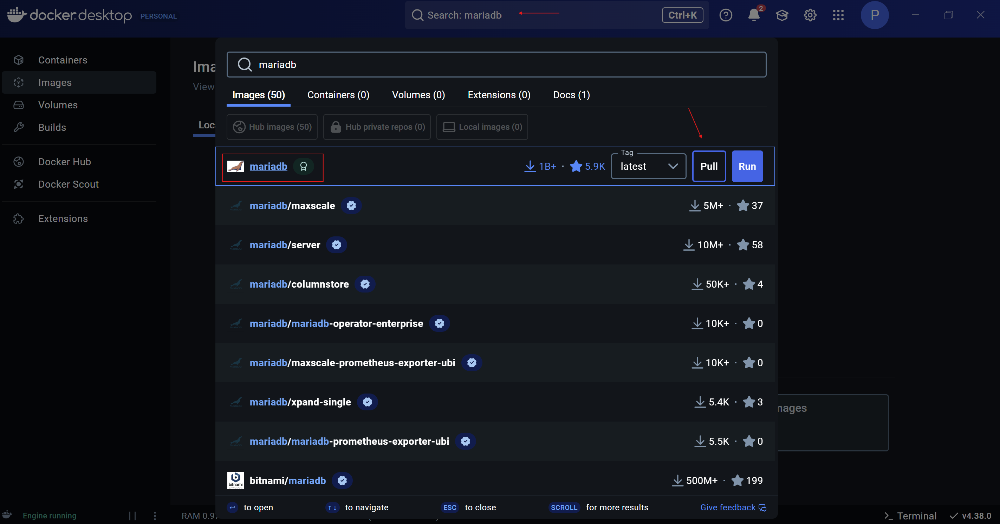

# Ejercicio 2  - Servidor de base de datos

1. Abro Docker Desktop. Busco `mariadb` en la sección de imágenes. Selecciono la imagen oficial. La descargo haciendo click en Pull.
    
    
    
    
    
    Aquí puedo ver la imagen de `mariadb`  descargada.
    
2. Despliego un contenedor utilizando esa imagen. Características:
    1. Nombre del contenedor: `bbdd`.
    2.  Puerto: 3306 - debe poder conectarse externamente
    3. Utiliza un volumen llamado `datos-mariadb`.
    4. Uso las variables de entorno necesarias para que el usuario `root` tenga la password `root`, la base de datos por defecto sea `base`  y se cree un usuario `daw`, con password `daw` .
    
    
    
3. Arranco el contenedor.
    
    
    
4. Accedo a la base de datos usando una herramienta gráfica, como, por ejemplo `dbeaver`. Me conecto con el usuario `daw`. Creo una base de datos y alguna tabla.
    
    
    
    
    
    Creo un script con el código de la creación de una tabla con dos atributos (Id y nombre) e inserto una fila con nombre ‘Ejemplo’. 
    
    
    
    Visualizo los datos de la tabla.
    
5. Borro el contenedor.
    
    
    
6. Veo en Docker Desktop que el volumen que contiene los datos no se ha borrado.
    
    
    
7. Creo otro contenedor con un servidor de base de datos que use el mismo volumen. Llamo al contenedor `bbdd-2`. Compruebo que la base de datos y la tabla creada anteriormente siguen ahí.
    
    
    
    
    
    
    
8. Intento borrar la imagen de `mariadb` ¿Qué sucede?
    
    
    
    No se puede borrar la imagen porque `bbdd-2`  la está usando.
    
9. Borro todo, volumen, imagen y contenedor.
    - Borro el contenedor
        
        
        
    - Borro la imagen
        
        
        
    - Borro el volumen
        
        