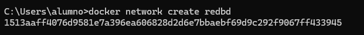

# Ejercicio3 - Contenedores en red

1. El primer paso es crear la red, que se llamará `redbd`. Para ello hago uso del comando:

```bash
docker network create redbd

```



1. Ahora creo el contenedor con la imagen de **Mariadb** en la red `redbd` que acabamos de crear:

```bash
docker run -d --name mariadb --network redbd -e MYSQL_ROOT_PASSWORD=rootpassword -e MYSQL_DATABASE=daw -e MYSQL_USER=daw -e MYSQL_PASSWORD=password -v mariadb-data:/var/lib/mysql -p 3306:3306 mariadb

```


Por si acaso, compruebo que el contenedor está corriendo con:

```bash
docker ps
```


Efectivamente, está corriendo el contenedor

1. Ahora, creo un contenedor **Adminer** para conectarme al contenedor de la base de datos

```bash
docker run -d --name adminer --network redbd -p 8080:8080 adminer

```


1. Compruebo que funciona correctamente accediendo al localhost, al puerto **8080**:


Nos muestra esta interfaz de Adminer:


Escribo las credenciales de acceso y entro en la interfaz gráfica:


Ahora que ya tengo mi base de datos creada, `daw` voy a crear una tabla:


Tras haber creado la tabla de prueba, borro los contenedores de prueba creados en la red. Lo voy a hacer por comandos ya que llevo haciendo todo este ejercicio así:

Entonces, elimino los contenedores:

```bash
docker stop mariadb adminer
docker rm mariadb adminer
```


Elimino la red:

```bash
docker network rm redbd
```


Elimino también el volumen de mariadb:

```bash
docker volume rm mariadb-data
```


Finalmente, para terminar el ejercicio, compruebo que se ha borrado todo correctamente.

Contenedores de mariadb y adminer:

```bash
docker ps -a
```

Red:

```bash
docker network ls
```

Volumen de mariadb:

```bash
docker volume ls
```


Vemos que no hay rastro ya de lo que se creó para el ejercicio, se ha borrado correctamente.