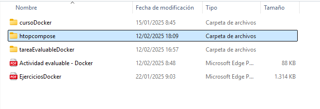

# Ejercicio4 - Docker Compose

Vamos a desplegar la aplicación `htop` con Docker Compose

1. Creo una carpeta htopcompose que es donde voy a tener los archivos de configuración luego:



1. Abro con el Visual Studio Code esa carpeta y creo un archivo de Docker que voy a llamar `docker-compose.yaml` . Le añado el siguiente contenido al fichero:

En este fichero, especifico la versión que quiero utilizar de Docker Compose.

El nombre del servicio que queremos crear, es `htop` , que usará la imagen htop de Docker Hub.

El nombre que le daremos al contenedor será `htop_app` para así identificarlo fácilmente si tenemos más contenedores corriendo.

Con los comandos stdin_open y tty ambos a true, lo que hacemos el permitir el uso del terminal para poder escribir comandos al ser una aplicación interactiva.


1. Ahora, abro un terminal en la carpeta `htopcompose` y ejecuto el siguiente comando para arrancar el contenedor:

```bash
docker-compose up
```


Pulso la letra `d` y me dirige a Docker Desktop, donde puedo comprobar que ese contenedor se está ejecutando correctamente:


1. Sabiendo ya que el contenedor está corriendo, podemos acceder a la interfaz de `htop` haciendo:

```bash
docker exec -it htop_app htop
```

La aplicación de `htop` es un monitor de procesos interactivo para UNIX y Linux.

Tiene una interfaz visual e intuitiva, que permite, entre otras cosas, ver procesos en tiempo real, monitorear el uso de CPU y memoria. Ver, ordenar, filtrar y procesos.

Realmente es útil para administrar recursos del sistema y detectar procesos que consuman mucha CPU o memoria RAM.

Se podría hacer una comparación con el Administrador de Tareas de Windows.

Esta es la interfaz gráfica de la aplicación `htop` :


En la captura que adjunto, se puede ver que hay 2 tareas, 1 en ejecución (running) , y de ellos podemos ver:

El id del proceso, el usuario, el % de CPU que están consumiendo, el tiempo, el % de memoria….entre otras cosas.