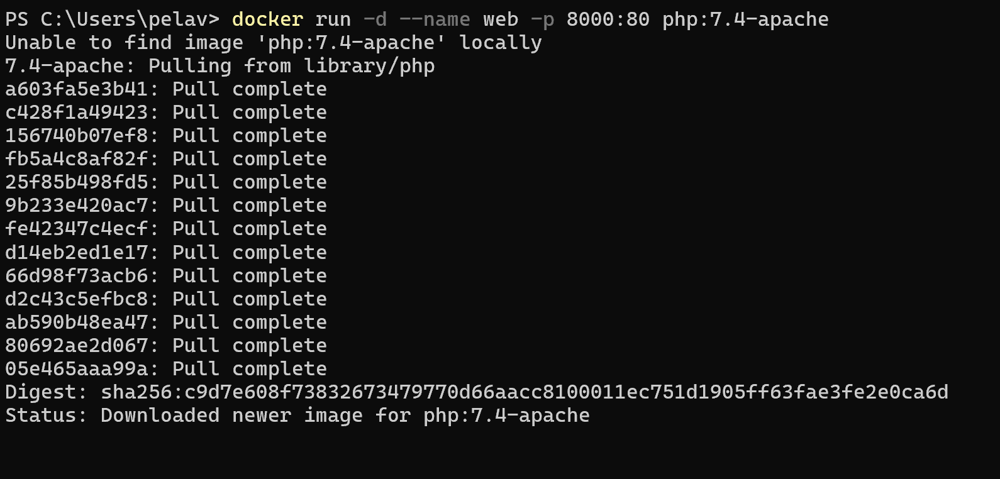

# Ejercicio 5 - Imagen con Dockerfile - Aplicación web

Para la realización de este ejercicio es necesario tener una cuenta de Docker Hub

1. Arranco un contenedor que ejecute una instancia de la imagen `php:7.4-apache` , que se llame `web` y que sea accesible desde un navegador en el puerto 8000.
    
    ```php
    docker run -d --name web -p 8000:80 php:7.4-apache
    ```
    
    
    
2. Coloco en el directorio raíz del servicio web `/var/www/html` un sitio web donde figure el nombre de los componentes del grupo - el sitio deberá tener al menos un archivo `index.html` y un archivo `css` .
    - Primero creo un sitio web con los nombre de los componentes del grupo
        
        ```php
        mkdir sitioWebPelayoAlejandro
        ```
        
        
        
    - Ahora dentro del sitio web creado, añado un archivo index.html y un archivo css.
        
        
        
    
    - Modifico ambos ficheros para crear una página web simple, para poder ver en el navegador
        
        
        
        
        
3. Coloco en ese mismo directorio raíz el siguiente script `php` .
    
    ```php
    <?php
    setlocale(LC_TIME, "es_ES.UTF-8");
    $mes_actual = strftime("%B");
    $fecha_actual = date("d/m/Y");
    $hora_actual = date("H:i:s");
    echo "<h1>Información</h1>";
    echo "<p>Hoy es $fecha_actual</p>";
    echo "<p>El mes es: <strong>$mes_actual</strong></p>";
    echo "<p>Hora: $hora_actual</p>";
    ?>
    ```
    
    
    

- Una vez creado los tres ficheros, los llevo al directorio raíz `/var/www/html` .
    
    ```php
    docker cp index.html web:/var/www/html/
    docker cp estilos.css web:/var/www/html/
    docker cp script.php web:/var/www/html/
    
    ```
    
    
    
1. Veo la salida del script y de la página `index` en el navegador.
    
    ```php
    http://localhost:8000
    ```
    
    
    
    ```php
    http://localhost:8000/script.php
    ```
    
    
    
2. Automatizo estas operaciones creando un fichero Dockerfile.
    - Creo en el directorio donde cree los demás archivos el fichero dockerfile.txt
        
        ```php
        notepad Dockerfile
        ```
        
        
        
3. Subo la imagen a la cuenta de Docker Hub.
- Ejecuto el comando:
    
    ```jsx
    docker login
    ```
    
    
    
- Construyo la imagen de docker a partir del DockerFile
    
    ```php
    docker build -t web .
    ```
    
    
    
- Etiqueto la imagen con mi usuario de docker hub para poder subirla
    
    ```php
    docker tag web pelayovv20/web:latest
    ```
    
    
    
- Subo la imagen
    
    ```jsx
    docker push pelayovv20/web:latest
    ```
    
    
    
- Podemos ver que la imagen está creada
    
    ```jsx
    docker images
    ```
    
    
    
- Podemos ver también la imagen accediendo a Docker Hub e iniciando sesión
    
    
    

1. Para terminar, la otra persona se baja la imagen creada anteriormente y crea un contenedor con ella:

Este ejercicio lo realizó Pelayo, y la bajada de imagen y creación de contenedor, Alejandro.

Esta sería la imagen vista desde Docker Hub:


Voy al terminal y ejecuto comando:

```bash
docker pull pelayovv20/web
```


Una vez bajada la imagen, creo un contenedor con ella (uso el puerto 9090 porque el 8080 lo tengo configurado para otra cosa):

```bash
docker run -d --name contenedorAlejandroPrueba -p 9090:80 pelayovv20/web
```


Compruebo que efectivamente está corriendo:


Y ahora accedo al [localhost](http://localhost) en el navegador a ver si funciona:


Por último, paro y elimino el contenedor:


Eliminado correctamente, ya no lo tenemos: 

